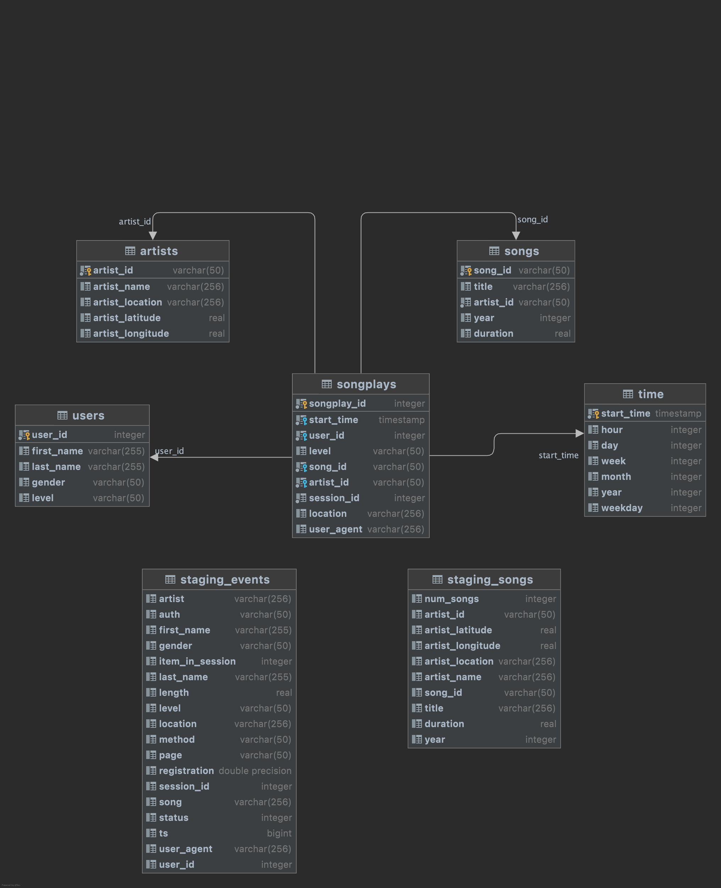
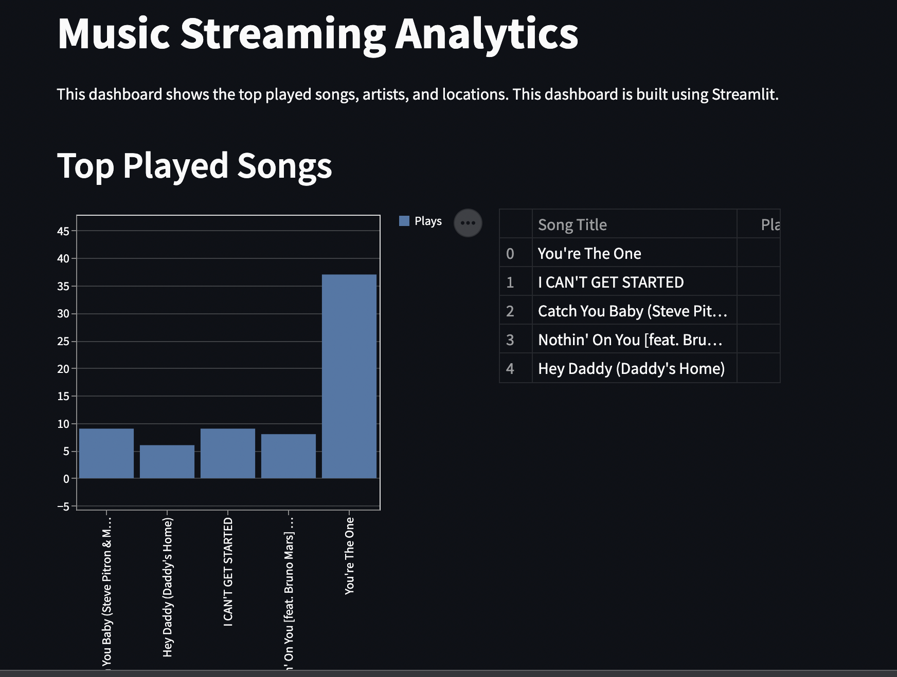

# Data Engineering - Data Warehouses AWS Redshift

## Contents
1. [Introduction](#introduction)
2. [Setup](#setup)
3. [Data Engineering](#data-engineering)
5. [Execute ETL](#execute-etl)
6. [Execute Dashboard](#execute-dashboard)
7. [References](#references)
8. [License](#license)
9. [Author](#author)


## Introduction
This is a project for the course of Data Warehouses from Udacity.

A music streaming startup, Sparkify, has grown their user base and song database and want to move their processes and data onto the cloud. 
Their data resides in S3, in a directory of JSON logs on user activity on the app, as well as a directory with JSON metadata on the songs in their app.

The project consists in building an ETL pipeline that extracts their data from S3, 
stages them in Redshift, and transforms data into a set of dimensional tables for their analytics team 
to continue finding insights in what songs their users are listening to.

## Setup
Install the requirements file by running the following command:
```
pip install -r requirements.txt
```

## Data Engineering
The data is stored in S3 in JSON format. The ETL pipeline extracts the data from S3, 
stages it in Redshift by creating stage tables, 
and transforms it into a set of dimensional tables for the analytics team to continue finding insights in what songs their users are listening to.

There are two datasets stored in S3:
1. `log_data` - contains the user activity logs
2. `song_data` - contains the metadata of the songs

### Step 1: Stage the data in Redshift

The **song data** is stored in JSON format. It contains the following fields:
1. `song_id` - a unique ID for each song
2. `title` - the title of the song
3. `artist_id` - the ID of the artist
4. `artist_name` - the name of the artist
5. `artist_location` - the location of the artist
6. `artist_latitude` - the latitude of the artist
7. `artist_longitude` - the longitude of the artist
8. `year` - the year the song was released
9. `duration` - the length of the song in seconds
10. `num_songs` - the number of songs by the artist

The song data is staged in Redshift by creating a table called `staging_songs`.
The data is loaded into the Redshift table by running the following command:
```
copy staging_songs
from s3_bucket 
iam_role iam_role_arn
format as json 'auto' 
```

The **log data** is stored in JSON format. It contains the following fields:
1. `artist` - the name of the artist
2. `auth` - the authentication method used
3. `firstName` - the first name of the user
4. `gender` - gender of the user
5. `itemInSession` - number of items in the session
6. `lastName` - the last name of the user
7. `lenght` - length of the session
8. `level` - level of the user
9. `location` - location of the user
10. `method` - the method used to access the data
11. `page` - the page accessed
12. `registration` - the registration date of the user
13. `sessionId` - the ID of the session
14. `song` - the name of the song
15. `status` - the status of the request
16. `ts` - the timestamp of the request
17. `userAgent` - the user agent of the user
18. `userId` - the ID of the user

The log data is staged in Redshift by creating a table called `staging_events`.
The data is loaded into the Redshift table by running the following command:
```
copy staging_events
from s3_bucket 
iam_role iam_role_arn
json json_path_file
```
The json path file is a JSON file that contains the path to the JSON file in the S3 bucket.
The json path expression specifies the explicit path to a single name element in a JSON hierarchical data structure.

### Step 2: Create the dimensional models

The second step is to create the dimensional tables that will be used to analyze the data.
The model consists of the following dimensions:
1. `users` - the users of the app
2. `songs` - the songs of the app
3. `artists` - the artists of the app
4. `time` - the time of the day

And the following fact table:
5. `songplays` - the fact table that contains the songplays of the app

The star model is displayed in the following figure:

## Execute ETL
First, run the table creation script:
```
python create_tables.py
```

Then, run the ETL pipeline:
```
python etl.py
```

## Execute the Dashboard
The dashboard shows a few analytics of the data. It is created
using the **streamlit framework**. Among the analytis are:
1. **Top played songs** - the top 5 most played songs
2. **Top played artists** - the top 5 most played artists

The dashboard is displayed in the following figure:


In order to run the dashboard, run the following command:
```
streamlit run dashboard.py
```

## References
- [Data Engineering](https://www.udacity.com/course/data-engineering-etl-pipeline--ud853)
- [Streamlit](https://streamlit.io/)
- [AWS Redshift](https://aws.amazon.com/redshift/)

## License
This project is licensed under the MIT License.

## Author
- [Erick Escobar.](https://www.linkedin.com/in/erick-escobar-892b20103/)